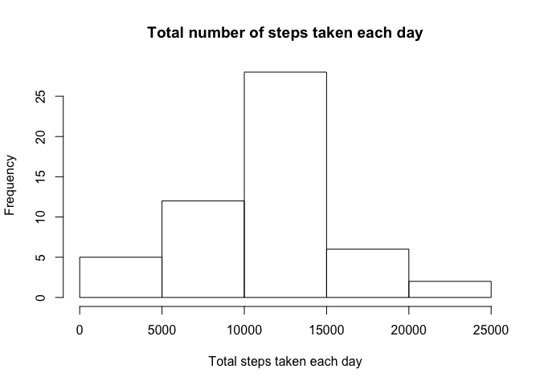
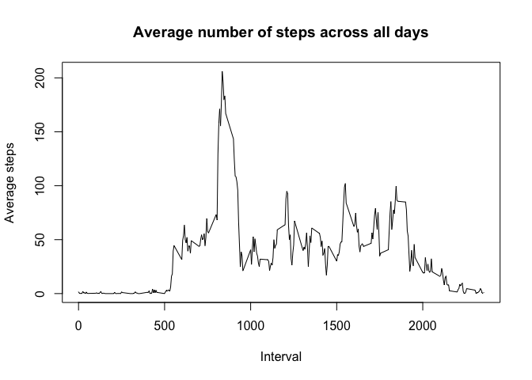
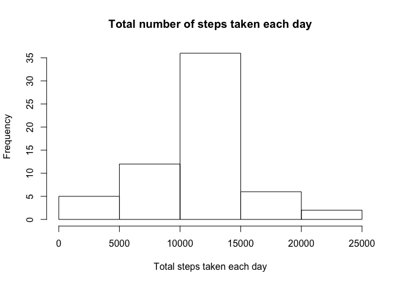
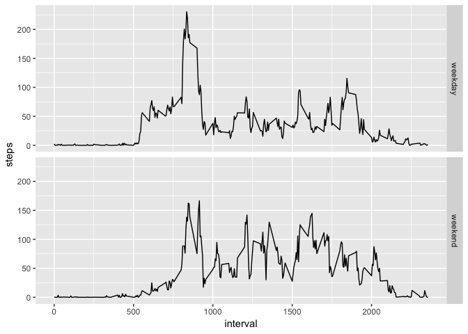

# Introduction

It is now possible to collect a large amount of data about personal movement using activity monitoring devices such as a Fitbit, Nike Fuelband, or Jawbone Up. These type of devices are part of the "quantified self" movement -- a group of enthusiasts who take measurements about themselves regularly to improve their health, to find patterns in their behavior, or because they are tech geeks. But these data remain under-utilized both because the raw data are hard to obtain and there is a lack of statistical methods and software for processing and interpreting the data.

This assignment makes use of data from a personal activity monitoring device. This device collects data at 5 minute intervals through out the day. The data consists of two months of data from an anonymous individual collected during the months of October and November, 2012 and include the number of steps taken in 5 minute intervals each day.

# Data

The data for this assignment can be downloaded from the course web site:

Dataset: Activity monitoring data [52K]

The variables included in this dataset are:

-steps: Number of steps taking in a 5-minute interval (missing values are coded as NA)

-date: The date on which the measurement was taken in YYYY-MM-DD format

-interval: Identifier for the 5-minute interval in which measurement was taken

The dataset is stored in a comma-separated-value (CSV) file and there are a total of 17,568 observations in this dataset.

# Assignment

## Loading and preprocessing the data


```r
library(readr)
data<-read_csv("activity.zip")
```

```
## Parsed with column specification:
## cols(
##   steps = col_double(),
##   date = col_date(format = ""),
##   interval = col_double()
## )
```

## What is mean total number of steps taken per day?

We ignored the missing values in the dataset and then made a histogram of the total number of steps taken each day.


```r
day_total<-tapply(data$steps[is.na(data$steps)==0], data$date[is.na(data$steps)==0], sum)
hist(day_total, xlab="Total steps taken each day", main="Total number of steps taken each day")
```

<!-- -->

```r
day_mean=mean(day_total)
day_median=median(day_total)
```

The mean total number of steps taken per day is 1.0766189\times 10^{4} and the median is 1.0765\times 10^{4}.

## What is the average daily activity pattern?

We made a time series plot of the 5-minute interval and the average number of steps taken, averaged across all days.


```r
interval_average<-tapply(data$steps, data$interval, mean, na.rm=TRUE)
plot(unique(data$interval), interval_average, type="l", xlab="Interval", ylab="Average steps", main="Average number of steps across all days")
```

<!-- -->

```r
interval_max=max(interval_average)
pos<-unique(data$interval)[which.max(interval_average)]
```

Interval 835, on average across all the days in the dataset, contains the maximum number of steps.

## Imputing missing values


```r
missing=is.na(data$steps)
missing_total=sum(missing)
steps_new<-data$steps
steps_new[missing]<-rep(interval_average, 61)[missing]
data_new<-data.frame(steps_new, data$date, data$interval)
names(data_new)=c("steps", "date", "interval")
day_total_new<-tapply(data_new$steps, data_new$date, sum)
hist(day_total_new, xlab="Total steps taken each day", main="Total number of steps taken each day")
```

<!-- -->

```r
day_mean_new=mean(day_total_new)
day_median_new=median(day_total_new)
```

There are 2304 days/intervals where there are missing values (coded as NA). The presence of missing days may introduce bias into some calculations or summaries of the data.

We use the mean for the missing 5-minute interval to create a new dataset called "data_new".  We also made a histogram of the total number of steps taken each day and calculate the new mean 1.0766189\times 10^{4} and new median 1.0766189\times 10^{4}.  The new values are pretty close to the old mean 1.0766189\times 10^{4} and median 1.0765\times 10^{4}, which shows that our imputation might be reasonable.

## Are there differences in activity patterns between weekdays and weekends?

We created a new factor variable "weekend" in the dataset with two levels -- "weekday" and "weekend" indicating whether a given date is a weekday or weekend day.  And then made a panel plot containing a time series plot of the 5-minute interval and the average number of steps taken, averaged across all weekday days or weekend days.


```r
data_new$weekday<-weekdays(data_new$date)
data_new$weekend[data_new$weekday=="Saturday"|data_new$weekday=="Sunday"]<-"weekend"
data_new$weekend[data_new$weekday!="Saturday"&data_new$weekday!="Sunday"]<-"weekday"
data_new$weekend<-as.factor(data_new$weekend)
weekend_average<-aggregate(steps~interval+weekend, data_new, mean)

library(ggplot2)
g<-ggplot(weekend_average, aes(interval, steps))
g+geom_line()+facet_grid(weekend_average$weekend~.)
```

<!-- -->
